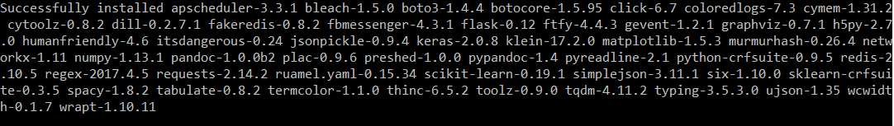
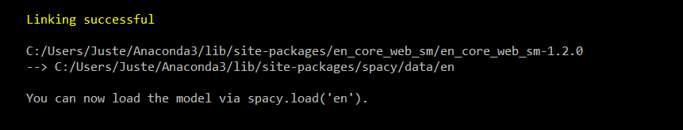
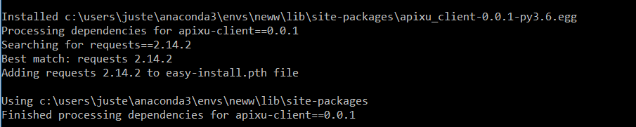
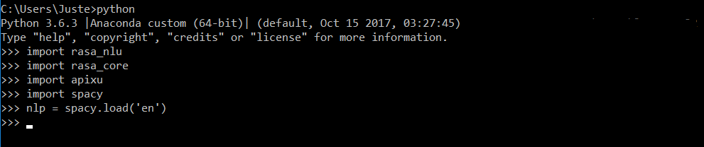
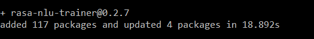

[//]: # (Image References)

[image1]: ./Pictures/requirements.png "img1"
[image2]: ./Pictures/spacy_model.png "img2"
[image3]: ./Pictures/apixu.png "img3"
[image4]: ./Pictures/npm.png "img4"

# BrumAI Rasa Workshop

Follow the instructions to install the required libraries and tools which will be used during the workshop:
1.	Install Python 3 (any version should work just fine, during the live demo Python 3.6.3 will be used).

	For people who are new to python, we recommend getting Python 3 with Anaconda https://www.anaconda.com/download/ 

2.	Download or clone this repository. This repo contains a requirements.txt file which we will use to install the dependencies. Install the dependencies by executing:

	**pip install -r requirements.txt**

	*Note: Requires C++ compilers. Make sure you got them on your machine or download and install them before installing dependencies from requirements.txt:*
	- Visual Studio for Windows https://www.visualstudio.com/ 
	- XCode for macOS/OS X https://developer.apple.com/xcode/ 
	- gcc for Ubuntu  https://gist.github.com/application2000/73fd6f4bf1be6600a2cf9f56315a2d91 

	The installation should run without the errors. A successful installation should be indicated by a message that the list of dependencies was successfully installed:

  

3.	Install spacy model by running:

	**python -m spacy download en**

	*Note: If installation throws an error, run the terminal as an administrator and rerun the command.*

	After the successful installation you should see a similar output in your console:

  

4.	Install rasa_core by running:

	**pip install rasa_core**
	
	The installation should be completed without any errors and it should end with a message saying that the libraries were successfully installed.	

5.	Install apixu library:

	- Download or clone https://github.com/apixu/apixu-python  
	- Unzip and execute:  
	**python setup.py install**
	
	A successful installation should be indicated by a message similar to the following:

  

	
6. As a sanity check, at this step you can launch your python interpreter and import rasa_nlu, rasa_core, apixu, spacy libraries as well as spacy model. If it doesn't throw you any errors, it means that everything was installed successfully.
	
	In your console type the following:
	
	
	**python** *(to launch the Python interpreter)*  
	**import rasa_nlu**  
	**import rasa_core**  
	**import apixu**  
	**import spacy**  
	**nlp = spacy.load('en')**
	  
	  
	If everything was installed successfully, you should see the following in your console:

  

	
	  
7.	Download and install npm and node from https://nodejs.org/en/download/

8.	Install rasa_nlu data visualisation tool by executing:

	**npm i -g rasa-nlu-trainer**

	A successful installation should result in a similar message in your console:

  

	

	
9. Get an apixu api Key by singing up at https://www.apixu.com/. This key will be used to make an api call which will return weather conditions in real time.
	
If you want, during this workshop you can use an IDE of your choice or you can stick to simple text editors (for example Notepad++). Both options will be just fine.	

If you have any questions or issues regarding the installation, feel free to message me directly or drop me an email to justina.petraityte@gmail.com and I will be glad to help you out :) 
